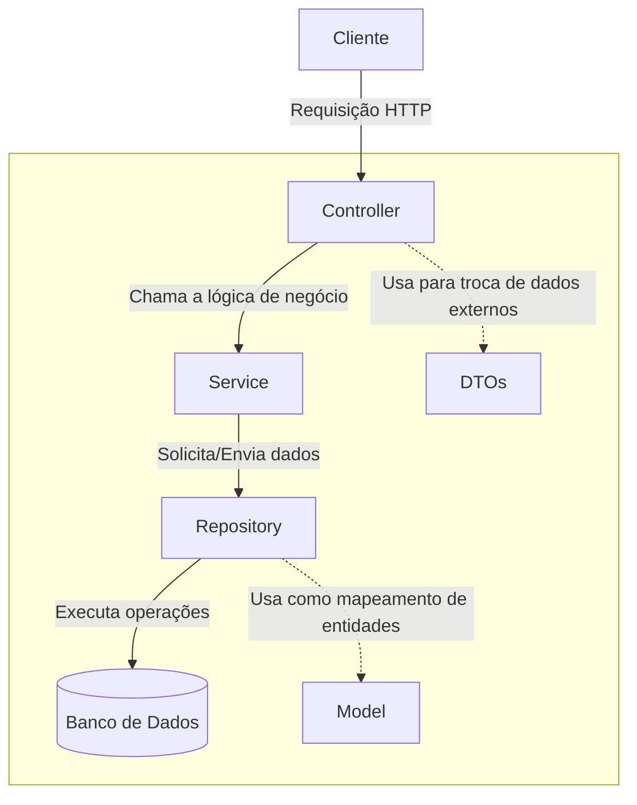

# Sistema de Acompanhamento de Egressos - UFU

## 📖 Sobre o Trabalho

Este repositório contém o **backend** do Sistema de Acompanhamento de Egressos da Universidade Federal de Uberlândia (UFU). O projeto foi desenvolvido como parte de um Trabalho de Conclusão de Curso (TCC) em Sistemas de Informação.

## ✨ Funcionalidades Principais

O backend oferece uma API RESTful para gerenciar as seguintes entidades:

  - **Egressos:** Cadastro e atualização dos dados pessoais e de contato dos ex-alunos.
  - **Informações Acadêmicas:** Gerenciamento da formação do egresso, tanto na UFU quanto em outras instituições.
  - **Informações Profissionais:** Registro do histórico de empregos e cargos ocupados.
  - **Depoimentos:** Permite que egressos deixem depoimentos sobre sua experiência na universidade.
  - **Publicações:** Cadastro de produções acadêmicas e científicas dos ex-alunos.
  - **Comunicados:** Envio de comunicados gerais ou segmentados por curso/nível.

## 📐 Arquitetura

A aplicação segue um padrão de arquitetura em camadas para garantir a separação de responsabilidades, organização e manutenibilidade do código.



  - **Controller:** Camada responsável por expor os endpoints da API, receber as requisições HTTP e retornar as respostas.
  - **Service:** Contém toda a lógica de negócio e as regras da aplicação.
  - **Repository:** Camada de acesso a dados, responsável pela comunicação com o banco de dados.
  - **Model (Entidades):** Representação das tabelas do banco de dados.
  - **DTO (Data Transfer Object):** Objetos utilizados para transferir dados entre as camadas e o cliente.

## 🛠️ Tecnologias Utilizadas

  - **Linguagem:** Java 17
  - **Framework:** Spring Boot 3.3.4
  - **Banco de Dados:** PostgreSQL 16
  - **Testes:** JUnit 5 e Mockito
  - **Documentação da API:** Springdoc OpenAPI (Swagger)
  - **Gerenciador de Dependências:** Maven
  - **Containerização:** Docker

## 🚀 Como Executar o Projeto

### Pré-requisitos

Antes de começar, você vai precisar ter instalado em sua máquina:

  - [Java (JDK) 17](https://www.oracle.com/java/technologies/javase/jdk17-archive-downloads.html)
  - [Apache Maven](https://maven.apache.org/download.cgi)
  - [Docker](https://www.docker.com/products/docker-desktop/)
  - [Git](https://git-scm.com/downloads)

### Rodando o Backend

1.  **Clone o repositório:**

    ```bash
    git clone https://github.com/VitoriaCardoso/sistemaegressos.git
    cd sistemaegressos
    ```

2.  **Inicie o banco de dados com Docker:**
    O projeto está configurado para usar o Docker Compose para gerenciar o banco de dados PostgreSQL. Na raiz do projeto, execute:

    ```bash
    docker-compose up -d
    ```

    Este comando irá iniciar o container do banco de dados em segundo plano.

3.  **Execute a aplicação:**
    Utilize o Maven para iniciar o servidor Spring Boot.

    ```bash
    mvn spring-boot:run
    ```

O servidor estará rodando em `http://localhost:8080`.

## 📚 Documentação da API

Com a aplicação em execução, a documentação completa da API, gerada pelo Swagger, pode ser acessada no seu navegador através do seguinte endereço:

[http://localhost:8080/swagger-ui.html](http://localhost:8080/swagger-ui.html)

A interface do Swagger permite visualizar e testar todos os endpoints disponíveis de forma interativa.

## 🚀 Testando com o Insomnia

Para facilitar os testes da API, uma coleção do Insomnia contendo exemplos de requisições para todos os endpoints está disponível neste repositório.

**Arquivo:** [Collection.yaml](https://github.com/VitoriaCardoso/sistemaegressos/blob/main/src/main/resources/Collection/Collection.yaml)

**Como usar:**
1.  Baixe e instale a versão mais recente do [Insomnia](https://insomnia.rest/download).
2.  Abra o aplicativo.
3.  No painel superior esquerdo, clique no nome do seu projeto para abrir o menu de ações.
4.  No menu, clique na opção **Import**.
5.  Na janela que se abrir, arraste o arquivo `Collection.yaml` ou procure por ele no seu computador para selecioná-lo.
6.  Após a importação, a coleção "**Sistemas de Egressos**" aparecerá na sua barra lateral, pronta para ser utilizada.

## 👩‍💻 Autoras

  - **[Vitória Cardoso](https://github.com/VitoriaCardoso)**
  - **[Paula Nascimento](https://github.com/paulafrdnascimento)**

### Orientadora

  - **[Maria Adriana Vidigal](https://github.com/madriana)**
